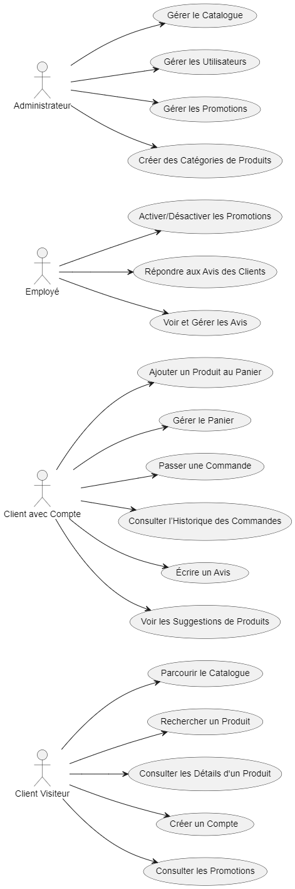
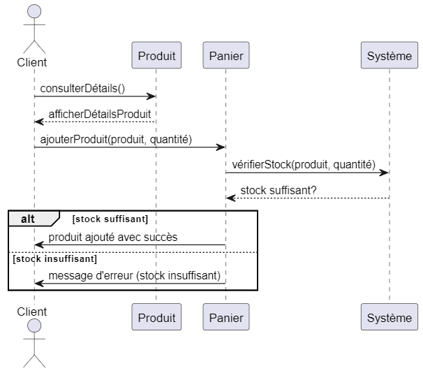
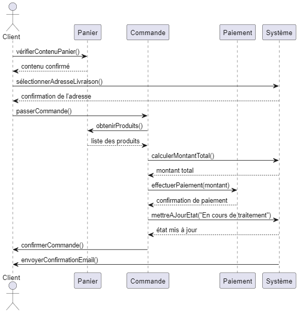
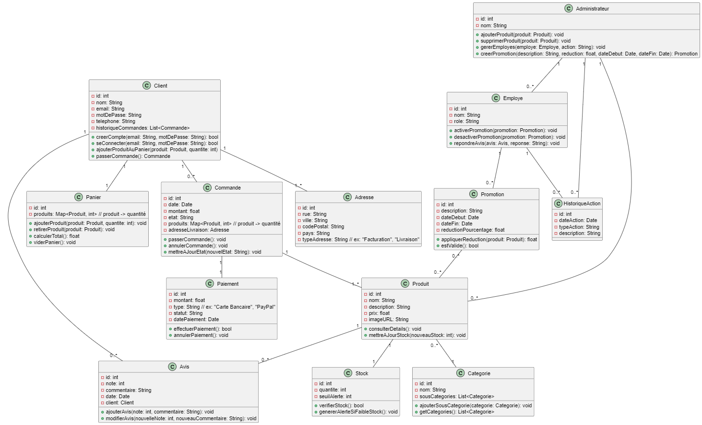

= Document de Conception - Projet SAÉ 3.01
:author: Equipe G1A-1
:date: {docdate}
:toc: macro
:numbered:

// Table of Contents
toc::[]

== Introduction

Ce document de conception détaille les éléments clés du projet de site e-commerce pour *BuildMyPC*. Il comprend les cas d'utilisation principaux, un diagramme de classes métier, et des diagrammes de conception pour les modules clés.

== Diagrammes de Use Case

=== Diagramme de Use Case général

Ce diagramme présente les interactions entre les différents types d’utilisateurs et les fonctionnalités principales de l'application.

=== Description des cas d'utilisation principaux

==== Use Case : Parcourir le Catalogue

- **Objectif** : Permettre aux utilisateurs de consulter le catalogue des produits pour voir les options disponibles.
- **Acteurs** : Client Visiteur, Client avec Compte
- **Préconditions** : L’utilisateur doit accéder à la page du catalogue sur le site.
- **Déroulement** :
  1. L’utilisateur accède à la page catalogue.
  2. Le système affiche les catégories de produits disponibles et une liste de produits populaires ou récemment ajoutés.
  3. L’utilisateur peut filtrer les produits par catégorie, prix, ou marque.
  4. L’utilisateur peut cliquer sur un produit pour consulter ses détails.
  5. Le système enregistre les produits consultés pour les suggestions ultérieures (facultatif).
- **Post-conditions** : L’utilisateur a pu voir les options de produits disponibles et peut poursuivre vers d’autres actions.

==== Use Case : Ajouter un Produit au Panier

- **Objectif** : Permettre aux clients connectés d’ajouter un produit à leur panier en vue d’un futur achat.
- **Acteurs** : Client avec Compte
- **Préconditions** : L’utilisateur doit être connecté et avoir consulté un produit.
- **Déroulement** :
  1. L’utilisateur consulte la page du produit et sélectionne la quantité souhaitée.
  2. L’utilisateur clique sur “Ajouter au panier”.
  3. Le système vérifie que le produit est disponible en stock.
  4. Si le stock est suffisant, le produit est ajouté au panier avec la quantité demandée.
  5. Si le stock est insuffisant, un message d’erreur est affiché et l’utilisateur est invité à choisir une quantité plus basse.
- **Post-conditions** : Le produit est ajouté au panier et l’utilisateur peut continuer ses achats ou consulter son panier.

==== Use Case : Passer une Commande

- **Objectif** : Permettre aux utilisateurs connectés de finaliser un achat en validant leur commande.
- **Acteurs** : Client avec Compte
- **Préconditions** : L’utilisateur doit être connecté et avoir des articles dans son panier.
- **Déroulement** :
  1. L’utilisateur accède à son panier et vérifie les articles.
  2. L’utilisateur sélectionne l’adresse de livraison ou en ajoute une nouvelle.
  3. L’utilisateur clique sur “Passer la commande”.
  4. Le système calcule le montant total et propose les options de paiement.
  5. L’utilisateur sélectionne son mode de paiement et entre les informations nécessaires.
  6. Le système valide le paiement et passe le statut de la commande à “En cours de traitement”.
  7. Le système envoie une confirmation de commande à l’utilisateur par email.
- **Post-conditions** : La commande est enregistrée et en cours de traitement.

==== Use Case : Appliquer une Promotion

- **Objectif** : Permettre aux employés ou administrateurs d’appliquer des promotions pour améliorer les ventes.
- **Acteurs** : Employé, Administrateur
- **Préconditions** : L’utilisateur (employé ou administrateur) est connecté et dispose des droits appropriés.
- **Déroulement** :
  1. L’utilisateur accède au tableau de gestion des promotions.
  2. L’utilisateur sélectionne une promotion et l’associe à un ou plusieurs produits.
  3. Le système met à jour les produits concernés avec la réduction.
- **Post-conditions** : La promotion est active et visible par les clients.

==== Use Case : Gérer les Avis

- **Objectif** : Permettre aux clients de publier des avis et aux employés de modérer ou répondre à ces avis.
- **Acteurs** : Client avec Compte, Employé
- **Préconditions** : Le client doit être connecté et avoir déjà acheté le produit.
- **Déroulement** :
  1. Le client accède à la page du produit et sélectionne “Ajouter un avis”.
  2. Le client remplit les informations de l’avis (note, commentaire) et soumet.
  3. Le système enregistre l’avis et l’associe au produit.
  4. L’employé peut consulter les avis et, si nécessaire, répondre ou modérer pour assurer leur conformité.
- **Post-conditions** : L’avis est visible pour les autres clients et contribue à la réputation du produit.

=== Diagrammes de Séquence

==== Diagramme de Séquence : Passer une Commande avec le Panier

Ce diagramme de séquence illustre le processus pour un client de passer une commande à partir de son panier, avec vérification de l'adresse de livraison, calcul du montant total, et confirmation du paiement.

==== Diagramme de Séquence : Ajouter un Produit au Panier

Ce diagramme de séquence montre l'interaction entre le client, le produit, le panier, et le système lorsqu'un client ajoute un produit à son panier. Le système vérifie la disponibilité du stock avant de confirmer l'ajout.

== Diagramme de Classe Métier

Le diagramme de classe métier ci-dessous illustre les principales entités de l'application e-commerce ainsi que leurs relations. Chaque classe représente une entité du système, et leurs attributs et méthodes reflètent les opérations essentielles pour le fonctionnement de la plateforme.

=== Description des principales classes métiers

- **Client** : Représente un utilisateur du site. Le client peut créer un compte, se connecter, ajouter des produits au panier, passer des commandes et consulter son historique de commandes. Chaque client a également la possibilité d'ajouter des avis sur les produits achetés.

- **Produit** : Représente les produits vendus sur le site, avec des attributs tels que le nom, la description, le prix et l'image. Les produits sont associés à une catégorie et un stock, et les clients peuvent consulter leurs détails.

- **Panier** : Associé à un client, le panier contient une collection de produits et leurs quantités. Le panier permet d'ajouter ou retirer des produits, de calculer le total des articles et de vider son contenu si nécessaire.

- **Commande** : Représente une commande passée par un client, contenant des produits, le montant total, et l'état de la commande (ex. "en cours", "livrée"). Une commande est également associée à un paiement et une adresse de livraison.

- **Adresse** : Contient les informations d'adresse pour la livraison ou la facturation. Chaque client peut avoir une ou plusieurs adresses, spécifiant la rue, la ville, le code postal, et le pays.

- **Avis** : Permet aux clients d'ajouter des avis sur les produits achetés, en donnant une note et un commentaire. Les avis sont liés aux produits et peuvent être modifiés ou modérés par les employés.

- **Promotion** : Permet la gestion des promotions sur le site, avec une réduction en pourcentage appliquée à certains produits. Une promotion a une période de validité et peut être activée ou désactivée.

- **Employe** : Employé du site ayant des droits pour activer ou désactiver des promotions, répondre aux avis des clients et gérer les commentaires. L'employé peut également voir l'historique de ses actions.

- **Administrateur** : Représente un utilisateur avec des droits supérieurs (administrateur) qui peut gérer les employés, ajouter ou supprimer des produits, et créer des promotions. L'administrateur a un contrôle complet sur les opérations critiques du site.

- **Paiement** : Gère le processus de paiement associé aux commandes. Un paiement inclut le montant, le type de paiement (ex. carte bancaire, PayPal), et son statut. Il peut être annulé si nécessaire.

- **Categorie** : Représente la classification des produits, avec la possibilité d’ajouter des sous-catégories pour organiser les produits dans des sections hiérarchiques.

- **Stock** : Représente le stock pour un produit donné. Il comprend la quantité en stock et un seuil d'alerte pour générer une notification en cas de faible stock.

- **HistoriqueAction** : Enregistre les actions réalisées par les employés ou administrateurs pour assurer un suivi des modifications importantes (ex. activation de promotions, ajout de produits).

== Diagrammes de Classe de Conception

Cette section inclut les diagrammes de classe de conception pour les modules clés de l'application.

=== Diagramme de conception pour la recherche de produits

Ce diagramme de classe de conception illustre le processus de recherche de produits par un client.

A venir

=== Diagramme de conception pour la gestion du panier

Ce diagramme décrit le processus d'ajout, de suppression, et de modification des produits dans le panier.

A venir

=== Diagramme de conception pour l'ajout d'un avis

Ce diagramme de classe de conception montre le processus d'ajout d'un avis pour un produit par un client.

A venir

== Conclusion
Ce document de conception détaille l'architecture et les choix de conception du projet, permettant une compréhension globale des interactions et des logiques métier sous-jacentes. Cette conception servira de base pour le développement et facilitera les futures évolutions.
